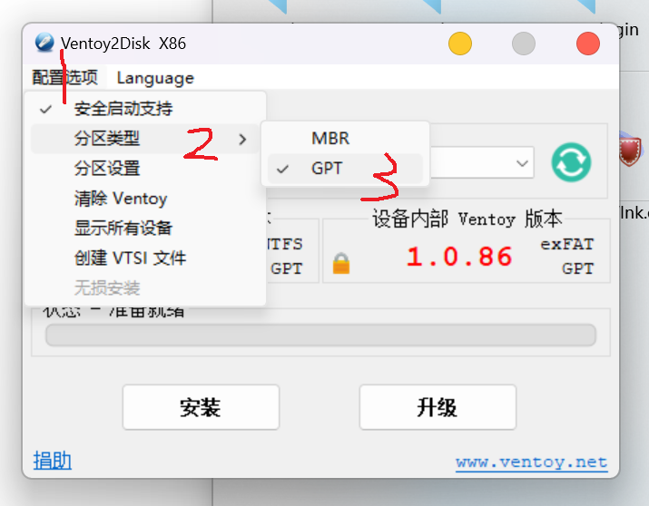
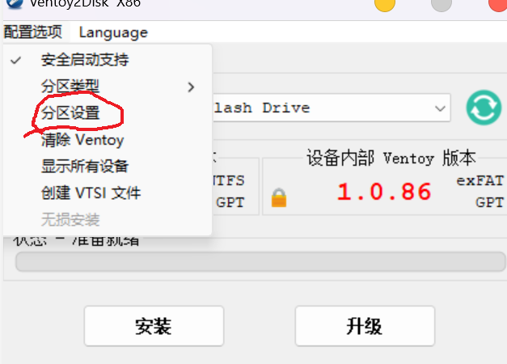
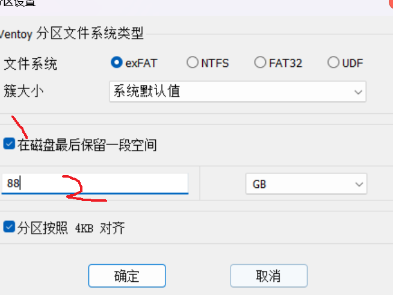
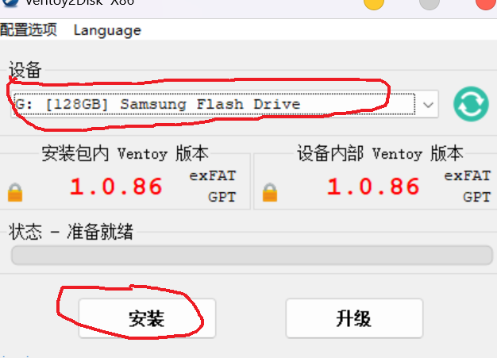
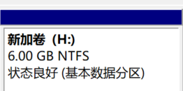
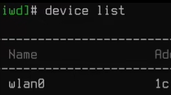
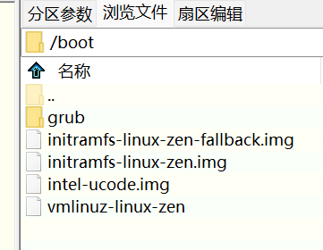
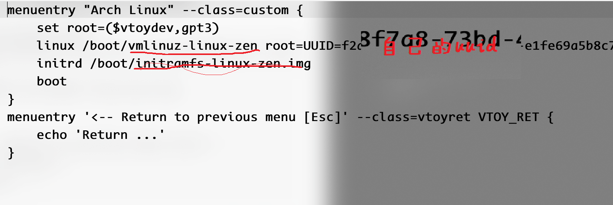

# 介绍

将arch安装到U盘中实现linux to go的效果

用的是arch+suckless三件套archlinux+dwm+st+dmenu由于是安装到U盘中的所以就不搞其他的花里胡哨的了够用就行，当然了普通的wps，qq，浏览器肯定都是可以正常用的

利用的是ventory工具

这里可以利用virtualbox创建虚拟机之后将vdi文件直接复制到U盘里面，但是需要用到ventory的插件，要将插件安装进linux系统中，还有一些小问题

所以我们这里直接利用ventory将U盘最后一段保留分区，直接将系统安装到U盘中

其余的空间可以当正常的U盘使用并且可以做启动U盘放入PE系统等等


# 第一部分（准备工作）

1. 首先肯定需要一个U盘，建议不低于128g（64g也不是不可以），速度的话看需求肯定是越快越好，如果用固态的话会更好。

2. 没有什么特殊需求的话普通U盘就够用了linux性能本来就不错，这里我用的是一个三星bar+的128gU盘（链接在下方）读取稳定在400m/s以内，写入70m/s和官网给的参数差不多，非常稳定不容易发热。

3. 容量的话正常使用（主要看应用比如就用用浏览器，QQ，wps，音乐等正常应用的话）一二十个g就够用了，一般不低于40个g左右

4. 清单（附下载链接）

   + 硬件

     1. [U盘](https://item.jd.com/7386535.html)
     2. 近几年的随便一款电脑（支持uefi）

   + 软件

     1. [ventory](https://www.ventoy.net/cn/download.html)

     2. [arch的iso文件](https://archlinux.org/download/)
     3. [DiskGenius](https://www.diskgenius.cn/download.php)

注：这里下载好后放在桌面即可不需要安装都是免安装的（DiskGenius免费版就可以了）iso的话往下找到中国的镜像站进行下载即可


这里可以看到清华的镜像站是两个其实上面的是https的下面的是http的

点进去之后


我们下载第一个iso文件大概七八百m即可


# 第二部分 U盘的制作

将下载好的ventory解压打开


运行软件



将分区改为GPT格式MBR比较古老了



之后点击分区设置



文件系统的话默认的exFAT（专门为U盘设计的格式）就可以如果是固态的话可以选择NTFS性能会更好（如果是U盘的话ntfs会减少使用寿命），把下面的保留空间打上勾，然后输入要保留的大小这个就是archlinux的空间大小，建议不小于40G即可，这里我分了88个G



之后点击确认即可

选择好设备之后（这里千万别选错了）这里会格式化整个U盘如果有重要资料记得备份，之后点击安装即可需要确认两次

等待安装成功即可


安装成功之后即可看到ventoyU盘，可以改名字不影响（尽量不要用中文）


这一部分可以当正常的U盘来使用可以放入iso文件当启动盘或者PE系统都可以

安装好后使用win+x


这里打开windows自带的磁盘管理器（K)


（由于我用的另一块U盘演示所以容量不一样不过不影响）可以看到前半段是exFAT的正常U盘，中间是ventoy软件的efi分区（arch的efi分区后面会手动添加进来安装arch的时候不需要在进行efi分区），后半段是我们还没有分配的分区，先分配一下后面安装linux的时候还会格式化的。


右键新建简单卷然后一直下一步下一步下一步即可


在点击下一步四个下一步之后点击完成即可



这个时候就添加好了


同时在资源管理器中也可以看见了

到这一步U盘就做好了

将下载好的arch的iso文件复制到VentoyU盘中注意是前面的U盘中不是后面新建的这个


# 第三部分 ventoy启动页面的美化（可选）


可以看到ventoy的启动界面并不是很好看（这里可改可不改直接跳过去第四步也可以）

我们去https://www.gnome-look.org/browse?cat=109&ord=latest这里面有好多ventoy的主题选一个直接喜欢的点开


往下找找到files

下载压缩包即可，这里可能非常慢耐心等等或者开github的加速器


下载好之后解压

将解压好后的的ventoy文件夹放入做好的ventoyU盘中即可注意是整个ventoy文件夹，比如


放入之后下次U盘启动的时候就会有主题了


# 第四部分 从U盘安装arch（正式安装）

安装arch的过程和普通安装差不多就是efi不一样，顺序可能有点区别但是大体一样的可以去参考官方的安装过程[atch wiki](https://wiki.archlinuxcn.org/wiki/%E5%AE%89%E8%A3%85%E6%8C%87%E5%8D%97)

1. 部分电脑可能需要关闭安全启动才可以，直接百度搜索自己电脑品牌的安全启动怎么关闭，每个品牌不一样我这里是开机按f2将安全启动关闭之后，使用U盘启动，插入U盘开机按f12（我这里是f12如果不对百度差一下自己的品牌）进入启动选项选择U盘启动即可
2. 进入ventoy界面，如果iso文件以及放入U盘中会自动检查出来的上下键选择archlinux的iso回车一路确定即可都是默认第一个选项


之后会进入一个类似这样的界面，相当于用一个arch安装另一台arch

台式机的话应该是会有网线如果是笔记本的话就用iwctl工具箱（台式机可以跳过这一步直接看第4步）

3. iwctl工具箱

   首先输入iwctl

   

   进入后输入`device list`

   

   会显示出虚拟的网卡名称这里是wlan0

   1. 之后输入`station wlan0 scan`（注意这里的命令是可以用tab键补全的）

   开启扫描网络

   2. `station wlan0 get-networks`

   显示可以连接的网络比如wifi名叫xxxx

   3. `station wlan0 connect xxxx`

   连接xxxx回车（enter）之后需要输入密码输入即可

   这里连接成功不会提醒的需要退出测试一下

   用`exit`退出iwctl工具

   之后用ping命令测试一下（这里添加了一个4次的参数）

   `ping -c 4 baidu.com`  


可以看到这里就是连接通了


4. 连接好网络之后需要更新一下用到的是pacman更新之前我们先去修改一下镜像源增加一下速度用

   `vim /etc/pacman.d/mirrorlist`

   + 打开镜像源文件可以看到里面有好多源咱们只用中国的https即可

   在vim中输入`/`就是查找然后输入China找到中国的镜像源将中国的镜像源移动到最前面，也可以把其他国家的删除，按jk上下移动hl左右移动两下d就是删除一行可以用v进入选择模式jkhl移动将China的这一部分选中之后用y复制然后按gg移动到开头用p将China的粘贴上去之后:（冒号）wq回车（enter）就是保存退出

   + 或者都删了这里用几个常用的
     + `Sever = https://mirrors.tuna.tsinghua.edu.cn/archlinux/$repo/os/$arch`
     + `Sever = https://mirrors.ustc.edu.cn/archlinux/$repo/os/$arch`
     + `Sever = https://mirrors.aliyun.com/archlinux/$repo/os/$arch`
     + `Sever = https://mirrors.163.com/archlinux/$repo/os/$arch`

添加好之后执行`pacman -Syy`进行同步，配置好镜像之后的速度应该很快

5. 同步之后进行分区这里我们只需要分一个系统分区即可（r如果有需要的话可以加一个swap）这里由于系统的内存够用就不分了

用`lsblk`查看一下磁盘应该有两个一个自带的固态硬盘还有一个U盘的

这里我们主要看U盘的（分不清的话看后面的大小就知道了）U盘应该有三个分区我们刚才分的（也有可能是vda什么的）（三个分区的就是了）比如：

+ sda

  + sda1
  + sda2
  + sda3

  这里sda1是硬盘的前半段用了当U盘以及启动盘使用

  sda2是ventoy的efi文件一会儿arch也需要借用这个不用单独给arch分配efi分区

  sda3就是咱们保留的空间了一会儿arch就要安装到这个里面

可以用cfdisk进行分区输入`cfdisk /dev/sda`回车（enter）即可不用输入分区数字


进入之后可以对照的网上这张图看，应该有三个分区sda1和sda2咱们都不动上下键移动到sda3上面选择类型（type）选择linux  filesystem回车（enter）选择写入（write）y确认即可

之后进行格式化`mkfs.ext4 /dev/sda3`这里也可以用比较新一些的xfs

我这里没有什么特殊需求就继续用ext4了


现在大部分的linux系统还是使用是ext4的格式

格式好之后会有Done完成

然后用`lsblk -f`可以查看格式

6. 将分区挂载`mount /dev/sda3 /mnt`即可

7. 将linux系统安装到U盘/mnt中用pacstrap命令

   这里我安装的linux-zen的内核对性能有一些优化也可以用linux内核

   `pacstrap /mnt linux linux-headers linux-firmware base base-devel vim bash-completion`

   如果用linux-zen的话就是linux-zen以及linux-zen-headers的头替换linux回车（enter）即可

   需要安装大约两个g左右文件

8. 生成表文件并且追加到fstab文件中

   `genfstab -U /mnt >> /mnt/etc/fstab`

   之后用cat命令看一下有没有成功

   `cat /mnt/etc/fstab`

   输出类似的uuid

   

记住uuid=后面的下一步要使用

9. 进入新系统

   `arch-chroot 、mnt`

   

10. 进入新系统之后更新一下`pacman -Syy`如果速度慢的话就去看一下镜像源还是在`vim /etc/pacman.d/mirrorlist`里面

11. 安装一下网络以及一些启动

    `pacman -S grub efibootmgr efivar networkmanager intel-ucode`

如果是amd的cpu就用amd-ucode替换intel-ucode

回车（enter）安装即可

安装好后修改一下启动参数

`vim /etc/default/grub`


之后用`grub-mkconfig -o /boot/grub/grub.cfg`写入配置


安装好用`systemctl enable NetworkManager`(这里都可以用tab补全)启动网络服务下一次就可以自动联网了

用`password`给新系统的默认的root用户创建一个密码

这里注意输入的密码是不会显示出来的需要输入两遍

之后退出新系统即可`exit`

然后卸载挂载分区

`umount /mnt`

之后`reboot`重启即可这里重启不进行任何操作应该会默认进入主系统

12. 使用diskgenius软件查看arch的efi文件




在boot分区中找到这个记住vmlinuz-linux-zen和initramfs-linux-zen.img

这两个（可能和我的不一样）记住名字一会儿要用

然后打开ventoryU盘


打开里面的ventoy文件夹如果跟着我做了第三部分的美化的话会有这个文件夹的如果没有就直接创建一个ventoy的文件夹在里面创建一个（ventoy_grub.cfg）文件右键编辑用记事本打开里面输入

```menuentry "Arch Linux" --class=custom {
    set root=($vtoydev,gpt3)
    linux /boot/vmlinuz-linux-zen root=UUID=facxxxx（这里的uuid换成自己的）
    initrd /boot/initramfs-linux-zen.img
    boot
}
menuentry '<-- Return to previous menu [Esc]' --class=vtoyret VTOY_RET {
    echo 'Return ...'
}
```

更换自己的uuid以及刚刚的vmlinuz-linux以及.img的其他的不用动保存关闭即可



13. 之后重启f12进入ventoy之后f6进入自定义的菜单可以看到arch linux的选项回车（enter）就可以进入新系统了
14. 
